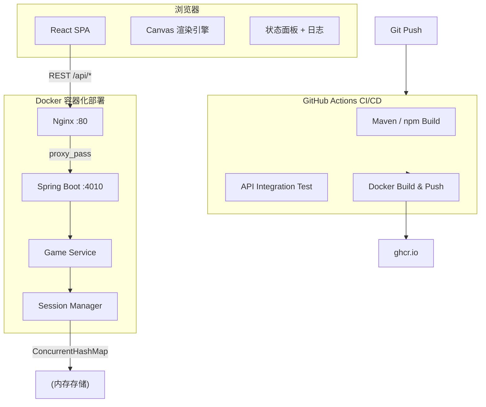
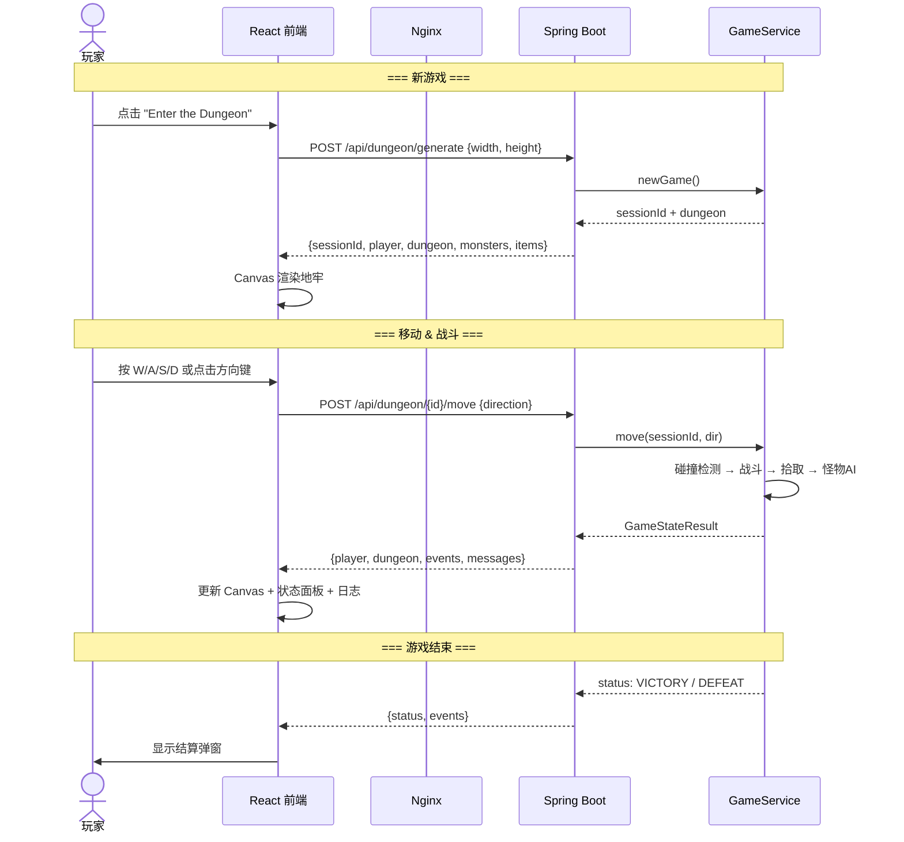

# Procedural Dungeon

> 2D Roguelike 地牢探索游戏 — 从命令行到 Web 应用的完整演进


---

## 项目介绍

Procedural Dungeon 是一款基于 BSP 算法随机生成地牢的 Roguelike 游戏。玩家在地牢中移动、战斗怪物、收集武器和药水、升级成长，最终消灭所有怪物获得胜利。

本项目是 **2026 春季学期 NCU 软件工程课程** 的实践项目，经历了从 C++ 命令行 MVP → Java/React Web 应用 → Docker 容器化 → CI/CD 自动化测试的完整工程演进。

### 核心特性

- **BSP 程序化地图生成**：房间 + 走廊 + 水域，每局独一无二
- **战争迷雾 (FOV)**：5 格视野范围，已探索区域半透明显示
- **回合制战斗**：玩家攻击 + 怪物 AI 追逐
- **物品系统**：武器 (+5 ATK)、药水 (+25 HP)
- **等级系统**：击败怪物获得经验，升级提升属性
- **多会话支持**：服务端同时管理多个游戏会话

---

## 系统架构



---

## 技术栈

| 层级 | 技术 | 说明 |
|------|------|------|
| **前端** | React 18 + Vite + Canvas API | 组件化 UI，Canvas 2D 瓦片渲染 |
| **后端** | Spring Boot 3.2 + JDK 17 | RESTful API，BSP 算法移植自 C++ |
| **API 文档** | OpenAPI 3.0 | [api/openapi.yaml](api/openapi.yaml) |
| **存储** | ConcurrentHashMap（内存） | 游戏会话临时存储，30 分钟自动过期 |
| **容器化** | Docker + docker-compose | 多阶段构建，后端 JRE 精简镜像，前端 Nginx 静态托管 |
| **CI/CD** | GitHub Actions | 自动构建、集成测试、Docker 镜像推送 |
| **测试** | JUnit 5 + Spring Boot Test | API 集成测试覆盖全部端点 |

---

## 项目结构

```
Procedural-Dungeon/
├── dungeon-server/              # 后端 Spring Boot 项目
│   ├── pom.xml
│   ├── Dockerfile
│   └── src/main/java/com/dungeon/
│       ├── DungeonApplication.java
│       ├── config/              # CORS、Web 配置
│       ├── controller/          # REST 控制器
│       ├── service/             # 业务逻辑 (地图生成、游戏引擎)
│       ├── model/               # 领域模型
│       ├── dto/                 # 请求/响应 DTO
│       └── exception/           # 全局异常处理
├── dungeon-web/                 # 前端 React 项目
│   ├── package.json
│   ├── vite.config.js
│   ├── nginx.conf
│   ├── Dockerfile
│   └── src/
│       ├── api/dungeonApi.js    # axios API 封装
│       ├── hooks/useGame.js     # 游戏状态 Hook
│       ├── components/          # UI 组件
│       └── utils/               # 工具函数
├── docker/
│   └── docker-compose.yml       # 一键启动
├── api/
│   └── openapi.yaml             # OpenAPI 3.0 规范
├── .github/workflows/
│   └── ci-cd.yml                # CI/CD 流水线
├── docs/
│   └── architecture.md          # 架构详细说明
└── DeepDungeon/                 # 旧版 C++ 命令行游戏 (MVP)
```

---

## 前后端交互流程



---

## API 文档

### 完整端点列表

| 方法 | URL | 说明 |
|------|-----|------|
| `POST` | `/api/dungeon/generate` | 生成新地牢，开始新游戏 |
| `GET` | `/api/dungeon/{id}/state` | 获取当前游戏状态 |
| `POST` | `/api/dungeon/{id}/move` | 玩家移动 (方向: up/down/left/right) |
| `POST` | `/api/dungeon/{id}/pickup` | 拾取脚下物品 |
| `POST` | `/api/dungeon/{id}/use-potion` | 使用背包中的药水 |
| `POST` | `/api/dungeon/{id}/wait` | 原地等待一回合 |
| `GET` | `/api/sessions` | 列出所有活跃会话 |
| `DELETE` | `/api/sessions/{id}` | 删除指定会话 |

### 快速示例

**生成地牢：**
```bash
curl -X POST http://localhost:4010/api/dungeon/generate \
  -H "Content-Type: application/json" \
  -d '{"width": 40, "height": 20}'
```

**移动玩家：**
```bash
curl -X POST http://localhost:4010/api/dungeon/{sessionId}/move \
  -H "Content-Type: application/json" \
  -d '{"direction": "up"}'
```

**获取状态：**
```bash
curl http://localhost:4010/api/dungeon/{sessionId}/state
```

完整 API 规范见 [api/openapi.yaml](api/openapi.yaml)。

### 响应状态码

| 状态码 | 含义 |
|--------|------|
| 200 | 成功 |
| 400 | 请求参数错误 (如无效方向、无物品可拾取) |
| 404 | 会话不存在或已过期 |
| 500 | 服务器内部错误 |

### 游戏状态值

| status | 含义 |
|--------|------|
| `PLAYING` | 游戏进行中 |
| `VICTORY` | 胜利（所有怪物被消灭） |
| `DEFEAT` | 失败（玩家 HP 归零） |

---

## 运行方式

### 本地开发

**后端：**
```bash
cd dungeon-server
./mvnw spring-boot:run    # 启动在 http://localhost:4010
```

**前端：**
```bash
cd dungeon-web
npm install
npm run dev               # 启动在 http://localhost:5173 (自动代理 API)
```

### Docker 运行

```bash
# 一键启动
docker compose -f docker/docker-compose.yml up -d

# 访问 http://localhost
```

### 单独构建镜像

```bash
# 后端
docker build -t dungeon-server dungeon-server/

# 前端
docker build -t dungeon-web dungeon-web/
```

---

## CI/CD 说明

CI/CD 流水线在每次 push 到 `main`/`develop` 分支及 Pull Request 时触发：

| Job | 说明 |
|-----|------|
| **Backend Build & Test** | Maven 编译 + 单元测试 |
| **Frontend Build** | npm ci + Vite 构建 |
| **API Integration Test** | 启动 Spring Boot → 测试 8 个 API 端点 → 关闭 |
| **Docker Build & Push** | 构建后端 Docker 镜像并推送到 GHCR (`main` 分支 push 时) |

镜像地址：`ghcr.io/{owner}/dungeon-server:latest`

---

## 团队

| 角色 | 成员 | GitHub |
|------|------|--------|
| Supervisor | 黎鹰 | — |
| Product Owner | 吴志翔 | [@xueyeduguazhou](https://github.com/xueyeduguazhou) |
| Scrum Master | 郑志军 | [@Jangkoole](https://github.com/Jangkoole) |
| Developer | 朱本繁 | [@jadehuan](https://github.com/jadehuan) |

**团队名称：** "It Works On My Machine"

**团队口号：** "No Bugs, Just Features."

---

## License

Apache License 2.0 — 详见 [LICENSE](LICENSE)
