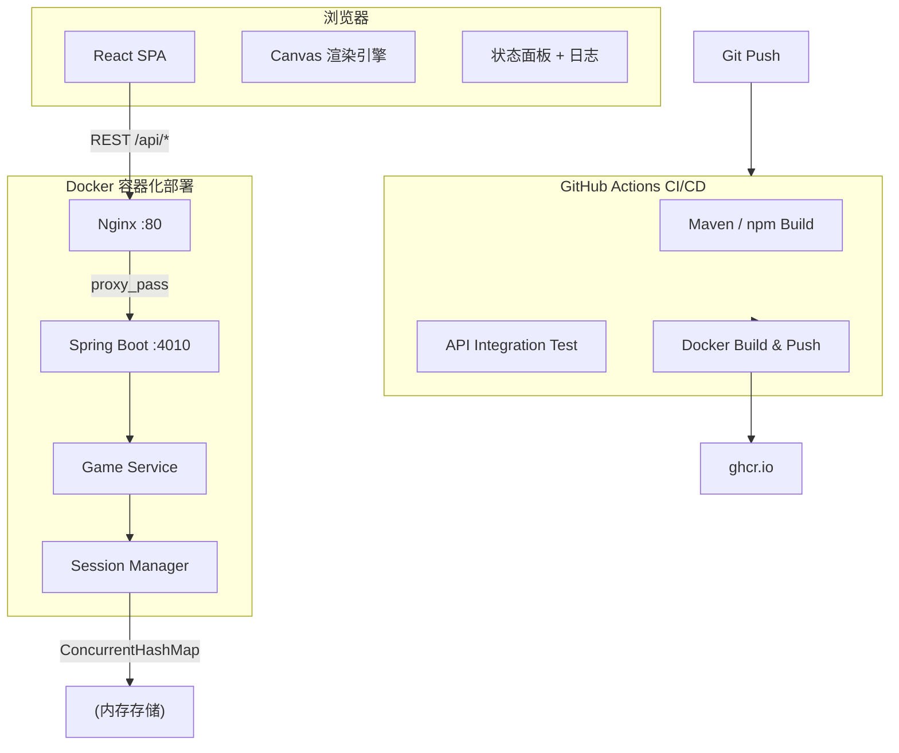
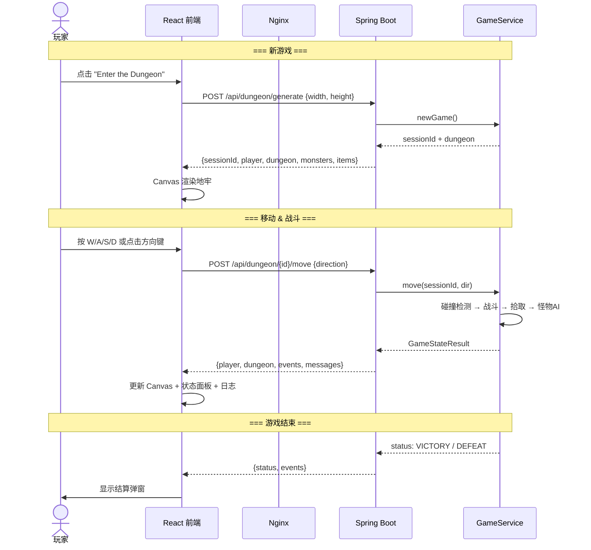

# Procedural Dungeon

> 2D Roguelike 地牢探索游戏 — 从命令行到 Web 应用的完整演进


---

## 项目介绍

Procedural Dungeon 是一款基于 BSP 算法随机生成地牢的 Roguelike 游戏。玩家在地牢中移动、战斗怪物、收集武器和药水、升级成长，最终消灭所有怪物获得胜利。

本项目是 **2026 春季学期 NCU 软件工程课程** 的实践项目，经历了从 C++ 命令行 MVP → Java/React Web 应用 → Docker 容器化 → CI/CD 自动化测试的完整工程演进。

### 核心特性

- **BSP 程序化地图生成**：房间 + 走廊 + 水域，每局独一无二
- **战争迷雾 (FOV)**：5 格视野范围，已探索区域半透明显示
- **回合制战斗**：玩家攻击 + 怪物 AI 追逐
- **物品系统**：武器 (+5 ATK)、药水 (+25 HP)
- **等级系统**：击败怪物获得经验，升级提升属性
- **多会话支持**：服务端同时管理多个游戏会话

---

## 系统架构



---

## 技术栈

| 层级 | 技术 | 说明 |
|------|------|------|
| **前端** | React 18 + Vite + Canvas API | 组件化 UI，Canvas 2D 瓦片渲染 |
| **后端** | Spring Boot 3.2 + JDK 17 | RESTful API，BSP 算法移植自 C++ |
| **API 文档** | OpenAPI 3.0 | [api/openapi.yaml](api/openapi.yaml) |
| **存储** | ConcurrentHashMap（内存） | 游戏会话临时存储，30 分钟自动过期 |
| **容器化** | Docker + docker-compose | 多阶段构建，后端 JRE 精简镜像，前端 Nginx 静态托管 |
| **CI/CD** | GitHub Actions | 自动构建、集成测试、Docker 镜像推送 |
| **测试** | JUnit 5 + Spring Boot Test | API 集成测试覆盖全部端点 |

---

## 项目结构

```
Procedural-Dungeon/
├── dungeon-server/              # 后端 Spring Boot 项目
│   ├── pom.xml
│   ├── Dockerfile
│   └── src/main/java/com/dungeon/
│       ├── DungeonApplication.java
│       ├── config/              # CORS、Web 配置
│       ├── controller/          # REST 控制器
│       ├── service/             # 业务逻辑 (地图生成、游戏引擎)
│       ├── model/               # 领域模型
│       ├── dto/                 # 请求/响应 DTO
│       └── exception/           # 全局异常处理
├── dungeon-web/                 # 前端 React 项目
│   ├── package.json
│   ├── vite.config.js
│   ├── nginx.conf
│   ├── Dockerfile
│   └── src/
│       ├── api/dungeonApi.js    # axios API 封装
│       ├── hooks/useGame.js     # 游戏状态 Hook
│       ├── components/          # UI 组件
│       └── utils/               # 工具函数
├── docker/
│   └── docker-compose.yml       # 一键启动
├── api/
│   └── openapi.yaml             # OpenAPI 3.0 规范
├── .github/workflows/
│   └── ci-cd.yml                # CI/CD 流水线
├── docs/
│   └── architecture.md          # 架构详细说明
└── DeepDungeon/                 # 旧版 C++ 命令行游戏 (MVP)
```

---

## 前后端交互流程



---

## API 文档

### 完整端点列表

| 方法 | URL | 说明 |
|------|-----|------|
| `POST` | `/api/dungeon/generate` | 生成新地牢，开始新游戏 |
| `GET` | `/api/dungeon/{id}/state` | 获取当前游戏状态 |
| `POST` | `/api/dungeon/{id}/move` | 玩家移动 (方向: up/down/left/right) |
| `POST` | `/api/dungeon/{id}/pickup` | 拾取脚下物品 |
| `POST` | `/api/dungeon/{id}/use-potion` | 使用背包中的药水 |
| `POST` | `/api/dungeon/{id}/wait` | 原地等待一回合 |
| `GET` | `/api/sessions` | 列出所有活跃会话 |
| `DELETE` | `/api/sessions/{id}` | 删除指定会话 |

### 快速示例

**生成地牢：**
```bash
curl -X POST http://localhost:4010/api/dungeon/generate \
  -H "Content-Type: application/json" \
  -d '{"width": 40, "height": 20}'
```

**移动玩家：**
```bash
curl -X POST http://localhost:4010/api/dungeon/{sessionId}/move \
  -H "Content-Type: application/json" \
  -d '{"direction": "up"}'
```

**获取状态：**
```bash
curl http://localhost:4010/api/dungeon/{sessionId}/state
```

完整 API 规范见 [api/openapi.yaml](api/openapi.yaml)。

### 响应状态码

| 状态码 | 含义 |
|--------|------|
| 200 | 成功 |
| 400 | 请求参数错误 (如无效方向、无物品可拾取) |
| 404 | 会话不存在或已过期 |
| 500 | 服务器内部错误 |

### 游戏状态值

| status | 含义 |
|--------|------|
| `PLAYING` | 游戏进行中 |
| `VICTORY` | 胜利（所有怪物被消灭） |
| `DEFEAT` | 失败（玩家 HP 归零） |

---

## 运行方式

### 本地开发

**后端：**
```bash
cd dungeon-server
./mvnw spring-boot:run    # 启动在 http://localhost:4010
```

**前端：**
```bash
cd dungeon-web
npm install
npm run dev               # 启动在 http://localhost:5173 (自动代理 API)
```

### Docker 运行

```bash
# 一键启动
docker compose -f docker/docker-compose.yml up -d

# 访问 http://localhost
```

### 单独构建镜像

```bash
# 后端
docker build -t dungeon-server dungeon-server/

# 前端
docker build -t dungeon-web dungeon-web/
```

---

## CI/CD 说明

CI/CD 流水线在每次 push 到 `main`/`develop` 分支及 Pull Request 时触发：

| Job | 说明 |
|-----|------|
| **Backend Build & Test** | Maven 编译 + 单元测试 |
| **Frontend Build** | npm ci + Vite 构建 |
| **API Integration Test** | 启动 Spring Boot → 测试 8 个 API 端点 → 关闭 |
| **Docker Build & Push** | 构建后端 Docker 镜像并推送到 GHCR (`main` 分支 push 时) |

镜像地址：`ghcr.io/{owner}/dungeon-server:latest`

---

## 团队

| 角色 | 成员 | GitHub |
|------|------|--------|
| Supervisor | 黎鹰 | — |
| Product Owner | 吴志翔 | [@xueyeduguazhou](https://github.com/xueyeduguazhou) |
| Scrum Master | 郑志军 | [@Jangkoole](https://github.com/Jangkoole) |
| Developer | 朱本繁 | [@jadehuan](https://github.com/jadehuan) |

**团队名称：** "It Works On My Machine"

**团队口号：** "No Bugs, Just Features."

---

## License

Apache License 2.0 — 详见 [LICENSE](LICENSE)
# 深度地牢 (Deep Dungeon)

一个硬核 Roguelike 地牢游戏，纯控制台版本，使用 C++17 开发。

> **课程项目：** 2026 春季学期 NCU 软件工程课程
> **团队：** It Works On My Machine
> **成员：** 吴志翔 (PO)、郑志军 (SM/架构)、朱本繁 (DT/前端)
> **指导老师：** 黎鹰

---

## 系统架构

### 模块关系图

```
┌─────────────────────────────────────────────────────────────┐
│                        main.cpp                             │
│              (程序入口：初始化 Game，主循环)                    │
└──────────────────────┬──────────────────────────────────────┘
                       │ 创建 & 驱动
                       ▼
┌─────────────────────────────────────────────────────────────┐
│                         Game                                │
│              (游戏主控制器：协调所有子系统)                      │
│                                                             │
│  ┌──────────┐  ┌──────────┐  ┌──────────┐  ┌────────────┐  │
│  │ 输入处理  │  │ 战斗系统  │  │ 怪物 AI  │  │  渲染输出   │  │
│  │handleInput│  │attackMons│  │updateMons│  │  render()  │  │
│  └─────┬────┘  └────┬─────┘  └────┬─────┘  └──────┬─────┘  │
│        │            │             │               │         │
│        ▼            ▼             ▼               ▼         │
│  ┌──────────────────────────────────────────────────────┐   │
│  │                    entities_ (实体列表)                │   │
│  │  ┌────────┐  ┌──────────┐  ┌──────────┐             │   │
│  │  │ Player │  │ Monster[]│  │  Item[]  │             │   │
│  │  └───┬────┘  └────┬─────┘  └────┬─────┘             │   │
│  └──────┼────────────┼─────────────┼───────────────────┘   │
│         │            │             │                        │
│         ▼            ▼             ▼                        │
│  ┌──────────────────────────────────────────────────────┐   │
│  │                        Map                           │   │
│  │          (40x20 网格地图 + 战争迷雾)                    │   │
│  └──────────────────────────────────────────────────────┘   │
└─────────────────────────────────────────────────────────────┘
```

### 类层次结构

```
dungeon::Entity  (基类：位置、属性、移动、受伤/治疗)
  ├── dungeon::Player  (玩家：经验/等级、武器加成、药水)
  ├── dungeon::Monster (怪物：HP 30, ATK 8, DEF 1)
  └── dungeon::Item    (物品：Weapon / Potion)

dungeon::Map     (地图：Tile 网格、房间生成、走廊、水域、FOV)
dungeon::Game    (游戏控制器：输入、战斗、AI、渲染、日志)
```

### 数据流

```
用户输入 (WASD/空格/P/Q)
    │
    ▼
Game::handleInput() ──→ Command 枚举
    │
    ▼
Game::tryMovePlayer() ──→ Player::move() / Game::attackMonster()
    │                              │
    │                              ▼
    │                    Entity::takeDamage() / Player::addExp()
    │
    ▼
Game::update()
    ├── Game::updateMonsters() ──→ Monster 追踪 AI → 攻击玩家
    ├── Game::checkCollisions()
    ├── Game::pickupItem()      ──→ Player::equipWeapon() / addPotion()
    └── Game::updateFOV()       ──→ Map::setTileVisible()
    │
    ▼
Game::render() ──→ 控制台输出 (地图 + 状态栏 + 日志)
```

---

## 核心业务模块职责说明

### 1. `Entity` — 实体基类
- **文件：** `include/Entity.h` + `src/Entity.cpp`
- **职责：** 所有游戏对象的基类，管理位置坐标 `(x, y)`、渲染符号、实体类型、HP/ATK/DEF 属性
- **关键方法：**
  - `move(dx, dy)` — 移动实体
  - `takeDamage(damage)` — 受到伤害（计算防御减免）
  - `heal(amount)` — 治疗（不超过最大 HP）
- **子类：**
  - `Player` — 玩家实体（符号 `@`）
  - `Monster` — 怪物实体（符号 `g`，HP 30, ATK 8, DEF 1）
  - `Item` — 物品实体，分为 `Weapon`（符号 `/`）和 `Potion`（符号 `!`）

### 2. `Player` — 玩家类
- **文件：** `include/Player.h` + `src/Player.cpp`
- **职责：** 管理玩家特有的状态：经验值、等级、武器攻击加成、药水数量
- **关键方法：**
  - `addExp(amount)` — 增加经验值，每 50 exp 升一级（HP+10, ATK+2, DEF+1，满血）
  - `totalAtk()` — 计算总攻击力（基础 ATK + 武器加成）
  - `usePotion()` — 使用一瓶药水，回复 25 HP
  - `equipWeapon(bonus)` — 装备武器，增加攻击加成

### 3. `Map` — 地图类
- **文件：** `include/Map.h` + `src/Map.cpp`
- **职责：** 管理 40×20 网格地图，提供地图生成、通行性判断、战争迷雾状态
- **关键方法：**
  - `generate(seed)` — 随机生成地图（先全填墙 → 生成 6 个房间 → L 形走廊连接 → 10% 概率水域）
  - `isWalkable(x, y)` — 判断某格是否可通行（地板和水域可通行）
  - `isWater(x, y)` — 判断某格是否为水域
  - `clearVisibility()` / `setTileVisible(x, y)` — 战争迷雾管理
- **数据结构：** `Tile` 结构体包含 `type`（Wall/Floor/Water）、`explored`（已探索）、`visible`（当前可见）

### 4. `Game` — 游戏主控制器
- **文件：** `include/Game.h` + `src/Game.cpp`
- **职责：** 游戏主循环的协调者，管理输入处理、战斗判定、怪物 AI、物品拾取、FOV 计算、渲染输出、日志记录
- **关键方法：**
  - `init()` — 初始化游戏（生成地图、放置玩家、生成怪物和物品）
  - `run()` — 游戏主循环（当前在 `main.cpp` 中实现）
  - `handleInput(input)` — 将用户输入字符串解析为 `Command` 枚举
  - `tryMovePlayer(dx, dy)` — 尝试移动玩家（含碰撞检测、战斗触发、物品拾取）
  - `update()` — 更新游戏状态（怪物 AI → 碰撞检测 → FOV 更新）
  - `render()` — 渲染当前游戏画面（地图 + 状态栏 + 日志）
- **注意：** 当前 `Game` 类承担职责较多（上帝类），后续 Sprint 计划拆分为多个子系统

### 5. `Constants.h` — 游戏常量
- **文件：** `include/Constants.h`
- **职责：** 集中管理所有游戏常量，包括地图尺寸、视野半径、角色符号、玩家基础属性

---

## 本地开发环境搭建

### 前置依赖

| 工具 | 版本要求 | 下载地址 |
|------|----------|----------|
| CMake | ≥ 3.16 | [https://cmake.org/download/](https://cmake.org/download/) |
| C++ 编译器 | 支持 C++17 | GCC (MinGW) / Clang / MSVC |
| Git | 任意版本 | [https://git-scm.com/](https://git-scm.com/) |

### Windows (MinGW) 搭建步骤

```bash
# 1. 克隆仓库
git clone <仓库地址>
cd ExperimentSoftwareEngineering/DeepDungeon

# 2. 配置 CMake（使用 MinGW）
mkdir build
cd build
cmake .. -G "MinGW Makefiles"

# 3. 编译
cmake --build .

# 4. 运行
.\DeepDungeon.exe
```

### Windows (Visual Studio) 搭建步骤

```bash
# 1. 克隆仓库
git clone <仓库地址>
cd ExperimentSoftwareEngineering/DeepDungeon

# 2. 配置 CMake（使用 VS 2022）
mkdir build
cd build
cmake .. -G "Visual Studio 17 2022"

# 3. 编译 Release 版本
cmake --build . --config Release

# 4. 运行
.\Release\DeepDungeon.exe
```

### Linux / macOS 搭建步骤

```bash
# 1. 克隆仓库
git clone <仓库地址>
cd ExperimentSoftwareEngineering/DeepDungeon

# 2. 配置 CMake
mkdir build
cd build
cmake ..

# 3. 编译
make

# 4. 运行
./DeepDungeon
```

### VS Code 快速构建（可选）

项目已配置 VS Code 构建任务（`.vscode/tasks.json`），使用 MinGW g++：

1. 在 VS Code 中打开 `DeepDungeon` 目录
2. 按 `Ctrl+Shift+B` 运行构建任务
3. 在终端中运行生成的 `DeepDungeon.exe`

> **注意：** VS Code 任务中的编译器路径 `E:\\C++\\mingw64\\bin\\g++.exe` 是特定机器路径，请根据您的 MinGW 安装位置修改。

### 验证安装

运行自动化冒烟测试脚本：

```bash
# Windows
test_run.bat
```

该脚本会模拟输入 `d d d s s q`（右移 3 步、下移 2 步、退出），验证游戏能正常启动和响应输入。

---

## 游戏操作

| 按键 | 功能 |
|------|------|
| W | 向上移动 |
| A | 向左移动 |
| S | 向下移动 |
| D | 向右移动 |
| 空格 | 等待一回合 |
| P | 使用药水 |
| Q | 退出游戏 |

## 游戏符号

| 符号 | 含义 |
|------|------|
| @ | 玩家 |
| # | 墙壁 |
| . | 地板 |
| ~ | 水（可通行） |
| g | 怪物 (Goblin) |
| / | 武器（ATK +5） |
| ! | 药水（回复 25 HP） |

## 开发计划

- [x] Sprint 1: 基础框架、移动、战斗
- [x] Sprint 2: 架构审查与重构规划
- [ ] Sprint 3: Bug 修复、单元测试框架、消除魔法数字
- [ ] Sprint 4: 怪物 AI 改进、物品系统重构
- [ ] Sprint 5: 拆分 Game 上帝类、子系统测试
- [ ] Sprint 6: 环境互动、回放系统、文档完善

---

## 项目文档

设计文档和 UML 图位于 `uml/` 目录：

| 文档 | 说明 |
|------|------|
| `需求规格说明书_SRS.md` | 功能需求、用例、数据流图 |
| `详细设计说明书_DDS.md` | 7 个关键算法的 PAD/N-S 图 |
| `架构审查与重构报告.md` | 代码坏味道分析、重构方案 |
| `可维护性五因素自评报告.md` | 可理解性/可测试性/可修改性/可移植性/可重用性自评 |
| `Sprint 2 启动 - MUD 架构解耦与重构规划.md` | Sprint 2 重构规划 |
| `产品待办列表_ProductBacklog.md` | 19 项任务的产品待办列表 |
| `*.plantuml` | 用例图、类图、顺序图、DFD、PAD 算法图 |

---

## 许可证

本项目基于 Apache License 2.0 开源。
